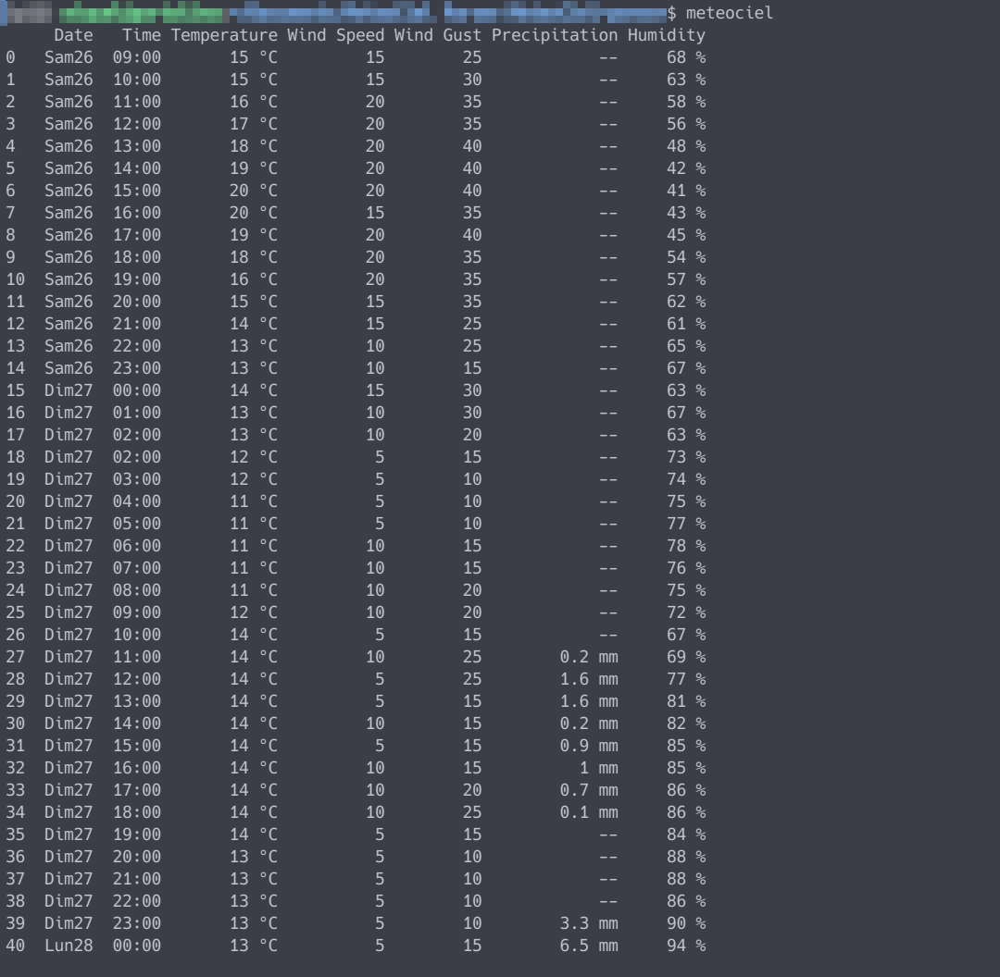
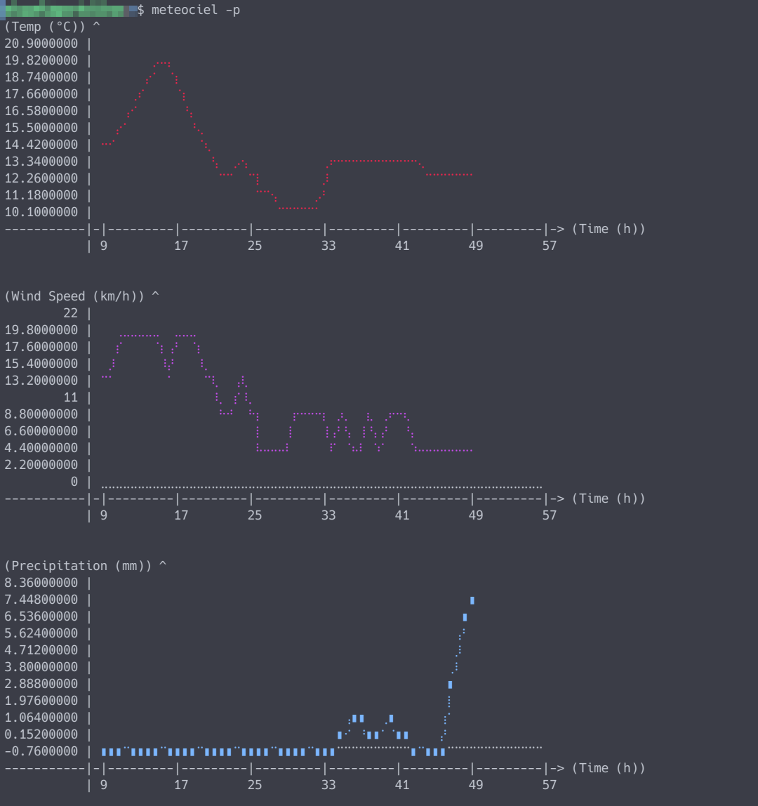

# Meteociel Weather Scraper

This is a personal Python script that fetches and parses hourly weather forecast data from [Meteociel](https://www.meteociel.fr/) for specified locations through their URL. It scrapes table data from Meteociel forecast pages and returns a structured DataFrame for analysis. If executed from outside, it prints a summary of the data, or if the '-p' option is given, plots the main weather features in ASCII.


## Features

1. **Weather Data Fetching**:
   - The script retrieves a detailed weather table from a given MeteoCiel URL and parses it into a structured `DataFrame`.
   - Columns include: Date, Time, Temperature, Feels Like, Wind Direction, Wind Speed, Wind Gust, Precipitation, Humidity, and Pressure.

2. **ASCII Plotting**:
   - If the `plotille` library is available, the script can produce ASCII-based plots for key weather variables (Temperature, Wind Speed, and Precipitation).
   - Plotting is triggered by adding the `-p` flag when running the script from the command line.
   - Time is shown in hourly increments, with temperature, wind speed, and precipitation displayed in individual subplots.


## Usage

### From Within Python

```python
from meteociel import fetch_weather

# Example: Fetch Paris weather data from the AROME model
url = 'https://www.meteociel.fr/previsions-arome-1h/27817/paris.htm'
weather = fetch_weather(url)
print(weather)
```

### From the Command Line

If run without the `-p` flag, the script will output a summary table of Date, Time, Temperature, Wind Speed, Wind Gust, Precipitation, and Humidity:

```bash
python meteociel.py https://www.meteociel.fr/previsions-arome-1h/27817/paris.htm
```


To enable ASCII plotting, use the `-p` flag:

```bash
python meteociel.py -p https://www.meteociel.fr/previsions-arome-1h/27817/paris.htm
```



## Dependencies

- `pandas`: Data manipulation and analysis.
- `requests`: HTTP requests for fetching web pages.
- `beautifulsoup4`: HTML parsing and data extraction.
- `plotille` (optional): ASCII plotting library for enhanced data visualization in the terminal.


## Acknowledgements

This project was greatly improved thanks to the valuable insight of [Dr. Vallés](https://github.com/dvallesp), whose expertise in the quokks field made this an elegant tool for weather display.

